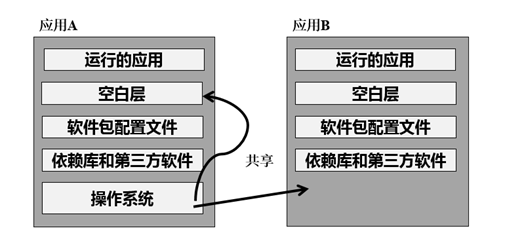

# 一、Docker简介

1. Docker 诞生
   Docker 是 dotcloud 公司开源的一款产品 dotcloud 是 2010 年新成立的一家公司，主要基于 PAAS ( Platfrom as a Service ) 平台为开发者提供服务。2013 年 10 月 dotcloud 公司改名为 Docker 股份有限公司

2. Docker 相关解释

* Linux Container  是一种内核虚拟化技术，可以提供轻量级的虚拟化，以便隔离进程和资源
* Docker  是  PAAS  提供商 dotCloud  开源的一个基于 LXC 的高级容器引擎，源代码托管在 Github 上, 基于 go 语言并遵从 Apache2.0 协议开源
* Docker 设想是交付运行环境如同海运，OS 如同一个货轮，每一个在 OS 基础上的软件都如同一个集装箱，用户可以通过标准化手段自由组装运行环境，同时集装箱的内容可以由用户自定义，也可以由专业人员制造

3. Docker 与传统虚拟化对比

   

4. Docker 的构成
* Docker 仓库：https://hub.docker.com
* Docker 自身组件
> Docker Client：Docker 的客户端
> Docker Server：Docker daemon 的主要组成部分，接受用户通过 Docker Client 发出的请求，并按照相应的路由规则实现路由分发
>
> 　  > Docker 镜像：Docker 镜像运行之后变成容器（docker run）

5. Docker 历经过程

   

